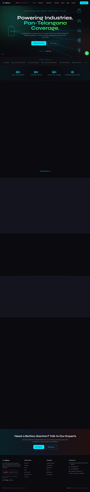
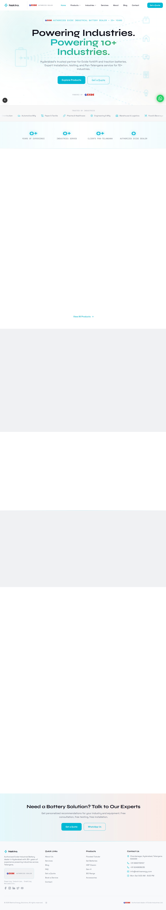

# Nektra Energy Solutions

Corporate website for **Nektra Energy Solutions** — authorized Exide industrial battery dealer serving Hyderabad & Telangana.


| Dark Mode | Light Mode |
|:-:|:-:|
|  |  |

## About

Nektra Energy Solutions is an authorized Exide industrial battery dealer based in Chandanagar, Hyderabad. With **35+ years of experience**, the company serves **500+ clients** across **10+ industries** with pan-Telangana coverage spanning 15+ service areas.

This website serves as the company's digital presence — a fully static, SEO-optimized site featuring a product catalog, industry-specific solutions, service bookings, a technical blog, and contact/quote request forms.

**Live site:** [nektraenergy.com](https://nektraenergy.com)

## Features

- **Product Catalog** — 6 industrial battery product lines (Motive Power Flooded Tubular, Gel, HSP Classic, Gen-X, BCI Range, Accessories) with detailed technical specifications
- **Industry Solutions** — 10 industry vertical pages (Pharmaceutical, Manufacturing, Logistics, Food & Beverage, Steel, Cement, Aviation, E-commerce, Automotive, Paper & Textile) with pain points, solutions, and recommended products
- **Services** — 7 service offerings including 24/7 emergency service, AMC contracts, and free installation
- **Blog** — Categorized technical articles on battery selection, maintenance, and industry standards
- **Light/Dark Theme** — System-aware theme with glass-morphism design system
- **SEO** — JSON-LD structured data (Organization, Product, Service, FAQ, Article, Breadcrumb), dynamic Open Graph images, XML sitemap, and robots.txt
- **LLM Discoverability** — `llms.txt` and `llms-full.txt` for AI-friendly site indexing
- **Fully Static** — No backend, database, or API routes; all pages pre-rendered at build time via `generateStaticParams()`
- **Accessible** — Reduced motion support, semantic HTML, responsive design
- **Forms** — Contact, quote request, and service booking with client-side validation

## Tech Stack

| Technology | Version | Purpose |
|---|---|---|
| [Next.js](https://nextjs.org) | 15.5 | App Router, static site generation |
| [React](https://react.dev) | 19 | UI framework |
| [TypeScript](https://typescriptlang.org) | 5 | Type safety (strict mode) |
| [Tailwind CSS](https://tailwindcss.com) | 3.4 | Utility-first styling |
| [Framer Motion](https://motion.dev) | 12 | Animations & transitions |
| [next-themes](https://github.com/pacocoursey/next-themes) | 0.4 | Light/dark theme switching |
| [Lucide React](https://lucide.dev) | 0.577 | Icon library |
| [Vercel](https://vercel.com) | — | Deployment, analytics, speed insights |

## Getting Started

**Prerequisites:** Node.js 18+ and npm.

```bash
git clone <repo-url>
cd nektra
npm install
```

```bash
npm run dev      # Development server on localhost:3000
npm run build    # Production build
npm run start    # Serve production build
npm run lint     # ESLint
```

No `.env` files are needed — this is a purely static site.

## Project Structure

```
nektra/
├── app/                    # Pages & routes (Next.js App Router)
│   ├── products/[slug]/    # Dynamic product detail pages
│   ├── industries/[slug]/  # Dynamic industry detail pages
│   ├── services/[slug]/    # Dynamic service detail pages
│   ├── blog/[slug]/        # Dynamic blog post pages
│   ├── blog/category/[slug]/ # Blog category pages
│   ├── about/              # About page
│   ├── contact/            # Contact page
│   ├── faq/                # FAQ page
│   ├── get-quote/          # Quote request form
│   ├── book-service/       # Service booking form
│   ├── battery-dealer-hyderabad/ # Local SEO page
│   ├── sitemap.ts          # Dynamic XML sitemap
│   ├── robots.ts           # robots.txt generation
│   └── opengraph-image.tsx # Dynamic OG image generation
├── components/
│   ├── ui/                 # Reusable primitives (GlassCard, GlowButton, MotionWrapper, etc.)
│   ├── home/               # Homepage sections (Hero, Stats, Products, Industries, etc.)
│   ├── forms/              # Contact, quote, and service booking forms
│   ├── layout/             # Navbar, Footer, ThemeProvider, ThemeToggle, WhatsAppButton
│   └── seo/                # JSON-LD schema injection
├── lib/
│   ├── constants.ts        # All site content (products, services, industries, blog, company info)
│   ├── types.ts            # TypeScript interfaces for all data models
│   ├── seo.ts              # generatePageMetadata() helper
│   ├── schema.ts           # JSON-LD schema generators
│   ├── icons.ts            # Lucide icon maps (industry, service, social)
│   ├── validation.ts       # Form validation (email, phone, required)
│   └── styles.ts           # Shared CSS class strings
├── hooks/
│   └── useMediaQuery.ts    # Client-side media query hook
├── public/
│   ├── images/             # Product, blog, and industry images
│   ├── llms.txt            # LLM discoverability summary
│   └── llms-full.txt       # Full LLM context
├── CLAUDE.md               # Detailed architecture guide for developers
├── tailwind.config.ts      # Design tokens, custom animations, glass utilities
├── next.config.mjs         # Security headers
└── package.json
```

## Architecture Overview

### Data-Driven Content

All site content is defined as typed arrays and objects in [`lib/constants.ts`](./lib/constants.ts). Pages import and render directly from these constants. Dynamic routes (`products/[slug]`, `industries/[slug]`, `services/[slug]`, `blog/[slug]`) use `generateStaticParams()` to enumerate slugs at build time.

**To add or edit content, modify `lib/constants.ts`** — no page-level changes are needed. Types for all data models live in [`lib/types.ts`](./lib/types.ts).

### Theming

Light/dark theme powered by `next-themes` with the class strategy (system default). Color definitions are CSS custom properties in `app/globals.css` (`:root` for light, `.dark` for dark). Tailwind references these via `tailwind.config.ts`, making all color utilities theme-aware automatically.

Design tokens include:
- **Colors:** Primary cyan, accent red, accent green
- **Surfaces:** `surface-deepest`, `surface-panel`, `surface-card`
- **Effects:** Glass morphism (`.glass`, `.glass-strong`), glow utilities
- **Fonts:** Syne (headings), Space Grotesk (body), JetBrains Mono (monospace)

### SEO

- `lib/seo.ts` — `generatePageMetadata()` for consistent OpenGraph/canonical metadata with the title template `%s | Nektra Energy Solutions`
- `lib/schema.ts` — JSON-LD schema generators (Organization, Product, Service, FAQ, Article, Breadcrumb, HowTo, CollectionPage, Industry)
- `app/sitemap.ts` and `app/robots.ts` — crawling configuration
- `app/opengraph-image.tsx` — dynamic OG image generation
- `public/llms.txt` and `public/llms-full.txt` — LLM discoverability

For detailed architecture documentation, see [CLAUDE.md](./CLAUDE.md).

## Content Management

All content is centralized in `lib/constants.ts`. Dynamic routes auto-generate pages at build time — no page-level changes are needed when adding content.

| To add a... | Modify this array | Type definition |
|---|---|---|
| Product | `PRODUCTS` | `Product` in `lib/types.ts` |
| Industry | `INDUSTRIES` | `Industry` in `lib/types.ts` |
| Service | `SERVICES` | `Service` in `lib/types.ts` |
| Blog post | `BLOG_POSTS` | `BlogPost` in `lib/types.ts` |
| FAQ | `FAQ_ITEMS` | `FAQItem` in `lib/types.ts` |

After adding an entry, run `npm run build` to generate the new static pages.

## Deployment

The site is deployed on **Vercel** with automatic deployments on push to `main`.

- **Analytics:** Vercel Analytics tracks page views and web vitals
- **Speed Insights:** Vercel Speed Insights monitors real-user performance
- **Security headers:** HSTS, X-Frame-Options, X-Content-Type-Options, Referrer-Policy, and Permissions-Policy configured in `next.config.mjs`

## License

All rights reserved.
